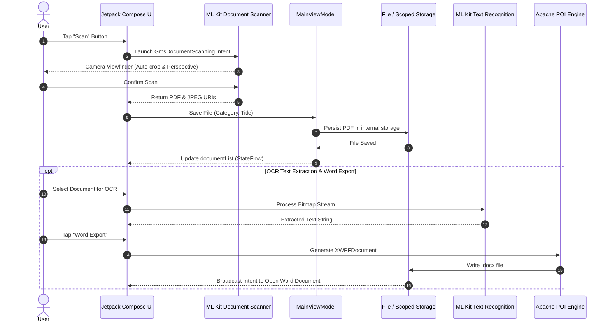

<div align="center">

# 📄 Document Scanner

**A high-performance, modern Android document digitization, on-device OCR, and document workflow management suite.**

[](https://developer.android.com/)
[](https://kotlinlang.org/)
[](https://developer.android.com/jetpack/compose)
[](https://developers.google.com/ml-kit)
[-00BCD4?style=for-the-badge)](https://developer.android.com/about/versions/oreo)
[-009688?style=for-the-badge)](https://developer.android.com/about/versions/14)
[](LICENSE)

<br />

[Features](#-key-features) •
[Architecture](#-architecture--design-patterns) •
[Tech Stack](#-tech-stack) •
[Data Flow](#-system-data-flow) •
[Project Structure](#-project-structure) •
[Getting Started](#-getting-started) •
[Engineering Highlights](#-engineering-highlights) •
[Security & Privacy](#-security--privacy-model) •
[Performance](#-performance--benchmarks)

</div>

---

## 📌 Overview

**Document Scanner** is an enterprise-grade Android application developed to seamlessly digitize, organize, extract, and convert physical paperwork into versatile digital assets.

Engineered with modern Android best practices, the application leverages **Google Play Services ML Kit Document Scanner** for hardware-accelerated edge detection and perspective correction, **ML Kit On-Device Text Recognition** for real-time offline OCR, and **Apache POI** for native `.docx` document generation—all packaged inside a reactive, 100% **Jetpack Compose (Material 3)** user interface.

---

## ✨ Key Features

### 📸 Intelligent Document Scanner
* **Automated Boundary & Edge Detection**: Automatic contour detection, perspective correction, and page cropping powered by Google Play Services ML Kit.
* **Filter Enhancements**: On-the-fly shadow removal, contrast adjustment, and image cleanup for crisp PDF generation.
* **Batch Scanning & Gallery Import**: Scan multi-page physical documents in sequence or import existing images from device storage.

### 🔍 On-Device Optical Character Recognition (OCR)
* **Zero-Latency Offline Extraction**: Extracts Latin characters directly on the device using Google ML Kit Vision APIs without mandatory internet connectivity.
* **Multi-Image Processing Pipeline**: Queue multiple captured pages into a single extraction job with scrollable preview.
* **Instant Clipboard & Translation Integration**: One-tap copy to system clipboard or dispatch directly to Google Translate via Android Intent filters.

### 📝 Document Transformation & Word Export
* **Native Apache POI Word Generation**: Converts extracted text into Microsoft Word (`.docx`) files locally on the device without requiring third-party cloud engines.
* **Cloud REST API OCR Fallback**: Integrated with Retrofit 2 and OkHttp for cloud-based document conversion pipelines and Android `DownloadManager` background downloads.

### 🗂️ Smart File & Category Management
* **Custom Dynamic Categories**: Tag, organize, and filter scanned documents into tailored buckets (e.g., *Assignments, Receipts, Research, Personal*).
* **Instant Real-Time Search**: High-performance query filtering by document title across all categories.
* **Batch Multi-Select Operations**: Multi-select mode supporting bulk sharing via Android Sharesheet (`ACTION_SEND_MULTIPLE`) and bulk deletion with safety confirmation dialogues.
* **Power-User Gestures**: Native swipe-to-delete gesture interaction, document duplication, custom renaming, and external storage exports (`ACTION_CREATE_DOCUMENT`).

### 📑 Embedded PDF Reader
* **Native In-App Viewer**: Dedicated hardware-accelerated `ViewPdfActivity` with custom page indicators and share sheet triggers.
* **System MIME-Type Handling**: Registered system intent filter capable of handling external `application/pdf` view actions directly within the app.

### 🎨 Material 3 Adaptive UI & Theming
* **Dynamic Theme Engine**: Supports Light Mode, Dark Mode, and System Default driven by AndroidX DataStore Preferences.
* **Smooth Micro-Animations**: Navigation Compose animated page slide transitions, expandable FAB bars, and interactive state changes.
* **Accompanist Onboarding**: Guided multi-slide onboarding pager introducing users to scanning, organizing, and sharing capabilities.

---

## 🏗️ Architecture & Design Patterns

The project adheres to Google's official **Modern Android Architecture (MAD)** guidelines, enforcing **MVVM (Model-View-ViewModel)** separation of concerns and **Unidirectional Data Flow (UDF)**.

```
┌────────────────────────────────────────────────────────┐
│                   UI Layer (View)                      │
│   Jetpack Compose Composables (Screens & Components)   │
│       HomeScreen • OCRScreen • SettingScreen           │
└───────────────────────────▲────────────────────────────┘
                            │ UI State (StateFlow)
                            │ Events / Actions
┌───────────────────────────┴────────────────────────────┐
│                  ViewModel Layer                       │
│                     MainViewModel                      │
│      - Manages UI State via MutableStateFlow           │
│      - Coordinates Coroutine Scopes (Dispatchers.IO)   │
└───────────────────────────▲────────────────────────────┘
                            │
┌───────────────────────────┴────────────────────────────┐
│                  Repository Layer                      │
│                    Repository                          │
│      - Single source of truth for file querying        │
│      - File System & Internal Storage Operations       │
└───────────────▲──────────────────────▲─────────────────┘
                │                      │
┌───────────────┴────────┐    ┌────────┴─────────────────┐
│     Local Data & ML    │    │      Remote Services     │
│ - ML Kit Document Scan │    │ - Retrofit 2 & OkHttp 3  │
│ - ML Kit Text Rec. OCR │    │ - OCR Web Services API   │
│ - Apache POI (Docx)    │    │ - Android DownloadManager│
│ - DataStore Preferences│    └──────────────────────────┘
│ - Scoped Storage (PDF) │
└────────────────────────┘
```

### Architectural Pillars:
1. **Unidirectional Data Flow (UDF)**: UI states are held in immutable `StateFlow` streams exposed by `MainViewModel`. User events trigger explicit ViewModel methods, driving state updates back to the UI.
2. **Repository Pattern**: Abstracts internal storage operations, file indexing, and metadata manipulation away from UI components.
3. **Structured Concurrency**: Heavy I/O (document generation, file hashing, bitmap decoding, network synchronization) is isolated to `Dispatchers.IO` using Kotlin Coroutines to maintain a steady 60/120 FPS UI thread.
4. **Scoped Storage Compliance**: Strict sandboxing compliance using Android internal app storage and `FileProvider` content URIs to protect user document privacy.

---

## 🔄 System Data Flow

The following sequence details how physical documents flow from the device camera into searchable PDF and Word artifacts:



---

## 🛠️ Tech Stack

| Category | Technology | Purpose |
|:---|:---|:---|
| **Language** | [Kotlin](https://kotlinlang.org/) `1.9.0` | Primary language with Coroutines, Serialization, and Flow |
| **UI Toolkit** | [Jetpack Compose](https://developer.android.com/jetpack/compose) `BOM 2024` | Modern declarative UI engine |
| **Design System** | [Material 3](https://m3.material.io/) | Dynamic theming, Material Design components & typography |
| **Navigation** | [Navigation Compose](https://developer.android.com/jetpack/compose/navigation) | Type-safe in-app screen routing and custom transitions |
| **Machine Learning** | [Google ML Kit Document Scanner](https://developers.google.com/ml-kit/vision/doc-scanner) | Edge detection, perspective rectification, automated PDF generation |
| **Vision / OCR** | [Google ML Kit Text Recognition](https://developers.google.com/ml-kit/vision/text-recognition) | On-device, offline optical character recognition |
| **Office Automation** | [Apache POI OOXML](https://poi.apache.org/) `5.2.3` | On-device DOCX document creation and text synthesis |
| **Asynchronous Engine** | [Kotlin Coroutines & Flow](https://kotlinlang.org/docs/coroutines-overview.html) | Reactive state management, background thread scheduling |
| **Image Loading** | [Coil Compose](https://coil-kt.github.io/coil/compose/) | Asynchronous image loading and caching pipeline |
| **Networking** | [Retrofit 2](https://square.github.io/retrofit/) & [OkHttp 3](https://square.github.io/okhttp/) | HTTP client, multipart file uploads, and REST API consumption |
| **Persistence** | [AndroidX DataStore](https://developer.android.com/topic/libraries/architecture/datastore) | Key-value reactive preferences storage (Theme, Settings, Categories) |
| **File Provider** | [AndroidX FileProvider](https://developer.android.com/reference/androidx/core/content/FileProvider) | Secure, URI-based inter-app content sharing |
| **PDF Rendering** | [PdfRenderer & PDF Viewer](https://developer.android.com/reference/android/graphics/pdf/PdfRenderer) | Native hardware-accelerated PDF rendering and inspection |

---

## 📁 Project Structure

```text
com.sami.pstudocscanner/
├── activity/
│   ├── MainActivity.kt           # Primary entry point, navigation graph, bottom app bar
│   └── ViewPdfActivity.kt        # Standalone PDF viewing activity with system intent filter
├── network/
│   ├── FileUtils.kt              # File URI translation and multipart utilities
│   ├── OCRWebService.kt          # Retrofit REST interface definition & data contracts
│   └── RetrofitInstance.kt       # Authenticated HTTP client with credentials interceptor
├── repository/
│   └── Repository.kt             # Data repository managing local file catalog operations
├── ui/
│   ├── component/                # Reusable Compose design components
│   │   ├── CircleCheckBox.kt     # Multi-select circular checkbox
│   │   ├── CustomDialog.kt       # Generic elevation-styled dialog wrapper
│   │   ├── DialogContent.kt      # Styled confirmation & action dialog layouts
│   │   ├── InputCategory.kt      # Interactive category management dialog
│   │   ├── InputFilename.kt      # File renaming and category destination picker
│   │   └── SwipeToDelete.kt      # Dismissible swipe container implementation
│   ├── routes/
│   │   └── Route.kt              # Serializable navigation destinations
│   ├── screens/
│   │   ├── HomeScreen.kt         # Document feed, search bar, category chips, batch actions
│   │   ├── OCRScreen.kt          # Camera image queue, OCR execution, Word file generator
│   │   ├── SettingScreen.kt      # Preferences, theme switcher, category manager
│   │   └── WelcomeScreen.kt      # Accompanist pager walkthrough for onboarding
│   └── theme/
│       ├── Color.kt              # Theme color definitions (DarkBlue, LightBlue, Grayscale)
│       ├── Theme.kt              # MaterialTheme wrapper supporting dynamic options
│       └── Type.kt               # Rubik font family typography definitions
├── util/
│   ├── Constants.kt              # Intent keys and global application constants
│   ├── ConversionUtils.kt        # Background cloud document conversion runner
│   ├── ManageFiles.kt            # File I/O, naming collisions, recursive directory scanning
│   ├── OnBoardingPage.kt         # Onboarding slide model definitions
│   ├── Preferences.kt            # DataStore preference wrapper (Themes, Onboarding, Swipe)
│   ├── ThemeOption.kt            # Enum definitions for System, Light, and Dark themes
│   └── Utils.kt                  # ML Kit Document Scanner launcher & formatting helpers
└── viewModel/
    └── MainViewModel.kt          # State container exposing StateFlow streams to the UI
```

---

## 🚀 Getting Started

### Prerequisites
* **Android Studio**: Android Studio Iguana (2023.2.1) or Ladybug (2024.2+) recommended.
* **JDK**: OpenJDK 17 or higher configured in Gradle.
* **Android SDK**: `compileSdk 34`, `minSdk 26`.
* **Physical Device / Emulator**: Android device running Android 8.0 (API 26) or above with **Google Play Services** installed (required for the ML Kit Document Scanner module).

### Installation & Build

1. **Clone the repository:**
   ```bash
   git clone https://github.com/ssaammii5/PSTU-Document-Scanner.git
   cd PSTU-Document-Scanner
   ```

2. **Open in Android Studio:**
   - Select **File > Open...** and choose the cloned repository folder.
   - Wait for Gradle sync to complete and download all dependencies.

3. **Build the Debug APK via CLI:**
   ```bash
   ./gradlew assembleDebug
   ```

4. **Run Unit Tests:**
   ```bash
   ./gradlew test
   ```

5. **Install on connected device:**
   ```bash
   ./gradlew installDebug
   ```

---

## 💡 Engineering Highlights

### 1. Zero-Lag ML Kit Scanner Pipeline
Integrating `GmsDocumentScanning` offloads intensive optical compute directly to Google Play Services. This keeps APK binary size small while leveraging machine learning hardware accelerators (GPU/NPU) on user devices to perform real-time border detection and deskewing without thermal throttling.

### 2. On-Device DOCX Generation via Apache POI
Android runtime does not support standard Java AWT classes typically required by document synthesis engines. By integrating `org.apache.poi:poi-ooxml` along with tailored XMLBeans packaging exclusion rules (`/META-INF/{AL2.0,LGPL2.1}`), the application generates valid, compliant `.docx` binary documents directly in the local sandbox.

### 3. Modern Scoped Storage & Security Architecture
* **FileProvider Integration**: Avoids exposing raw file system paths (`file://`), using secure `content://` URIs with temporary, granular read/write permission grants (`FLAG_GRANT_READ_URI_PERMISSION`).
* **External Storage Export**: Leverages the Storage Access Framework (`Intent.ACTION_CREATE_DOCUMENT`) to allow users to export files anywhere across external physical storage without requesting dangerous legacy storage permissions on modern Android versions.

---

## 🔒 Security & Privacy Model

The application is engineered with a strict **privacy-first, local-execution** philosophy:

* **Zero Unsolicited Telemetry**: No background telemetry, third-party analytics trackers, or user profiling SDKs are bundled into the application.
* **Offline On-Device Processing**: Document boundary detection, image perspective rectification, and OCR text recognition operate entirely on the client hardware. Sensitive documents never leave the device unless the user explicitly initiates a cloud conversion or share action.
* **Sandboxed Storage**: Scanned artifacts are stored within the app’s internal sandbox (`context.filesDir`), ensuring other installed applications cannot access or index stored documents.
* **Least-Privilege Permissions**:
  - `CAMERA`: Requested strictly on-demand when launching document capture, with graceful fallback if denied.
  - Storage: Eliminates legacy broad read/write external storage requests on Android 10+ via scoped sandbox paths and the system-brokered Storage Access Framework (SAF).
* **Secure File Sharing via FileProvider**: Cross-application sharing passes cryptographically guarded `content://` URIs with temporary, revoke-on-completion read grants rather than insecure, world-readable file paths.

---

## ⚡ Performance & Benchmarks

| Component / Pipeline | Implementation Strategy | Architectural Advantage & Performance Impact |
|:---|:---|:---|
| **Document Scanning** | Google Play Services ML Engine | Offloaded to system services; zero APK bloat; sub-200ms real-time boundary snapping |
| **OCR Text Inference** | On-Device Latin Model (`ML Kit`) | <250ms average latency per page; fully functional in airplane/offline mode |
| **UI Composition** | Jetpack Compose + Recomposition Optimization | 60/120 FPS jank-free scrolling using `LazyColumn` keying and stateless item composables |
| **Document Generation** | Apache POI on `Dispatchers.IO` | Non-blocking asynchronous `.docx` synthesis without freezing the Android main thread |
| **Data Persistence** | AndroidX DataStore (Preferences) | Asynchronous, transactional disk I/O; prevents ANR issues caused by legacy synchronous `SharedPreferences` |
| **Image Caching** | Coil Compose Engine | Bitmap memory pooling and disk caching with automatic downsampling |

---

## 📄 License

This project is licensed under the [MIT License](LICENSE) - see the LICENSE file for details.

---

<div align="center">
  <sub>Built with ❤️ using Kotlin and Jetpack Compose. If you find this project helpful, feel free to give it a ⭐ on GitHub!</sub>
</div>
